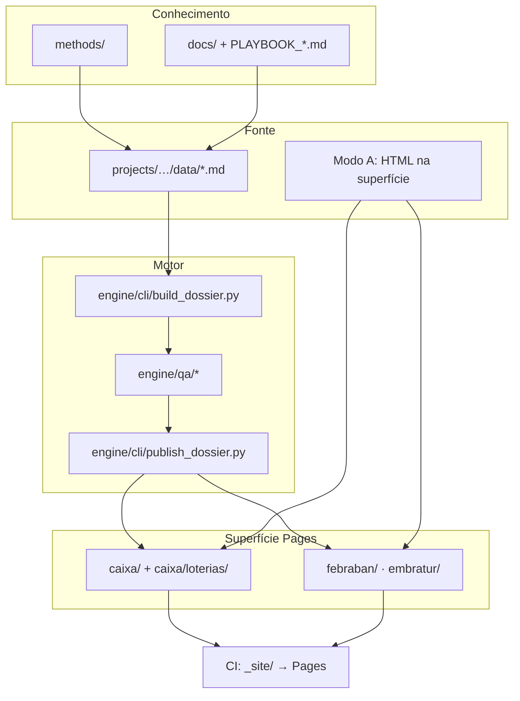

# Arquitetura do repositório — blueprint consolidado

**Documento único de estado-alvo** para reorganização do `calia-bi-reports`.

| Campo | Valor |
|-------|-------|
| **Status** | Executado (2026-07-01) |
| **Última revisão** | 2026-07-01 |
| **Escopo** | Estrutura de pastas, fluxos, CI/CD, migração e decisões arquiteturais |

---

## Índice

1. [Resumo executivo](#1-resumo-executivo)
2. [Diagnóstico do estado atual](#2-diagnóstico-do-estado-atual)
3. [Princípios de design](#3-princípios-de-design)
4. [As quatro zonas](#4-as-quatro-zonas)
5. [Árvore completa — estado-alvo](#5-árvore-completa--estado-alvo)
6. [Modos de produção (A / B / C)](#6-modos-de-produção-a--b--c)
7. [Fluxo de dados](#7-fluxo-de-dados)
8. [Clientes e subdomínios](#8-clientes-e-subdomínios)
9. [Caixa: institucional × Loterias](#9-caixa-institucional--loterias)
10. [Febraban e Embratur](#10-febraban-e-embratur)
11. [Projetos (`projects/`)](#11-projetos-projects)
12. [Motor (`engine/`)](#12-motor-engine)
13. [Métodos (`methods/`)](#13-métodos-methods)
14. [Documentação (`docs/`)](#14-documentação-docs)
15. [Deploy GitHub Pages](#15-deploy-github-pages)
16. [CI/CD](#16-cicd)
17. [Makefile e CLI](#17-makefile-e-cli)
18. [Inventário e governança](#18-inventário-e-governança)
19. [Mapa de migração completo](#19-mapa-de-migração-completo)
20. [Deletar, deprecar e congelar](#20-deletar-deprecar-e-congelar)
21. [Compatibilidade de URLs](#21-compatibilidade-de-urls)
22. [Fases de execução](#22-fases-de-execução)
23. [Decisões registradas (ADRs)](#23-decisões-registradas-adrs)
24. [Métricas de sucesso](#24-métricas-de-sucesso)
25. [Trade-offs](#25-trade-offs)
26. [Referências](#26-referências)

---

## 1. Resumo executivo

`calia-bi-reports` é um **monorepo** de dossiês HTML estáticos publicados via **GitHub Pages** (`https://epieratti.github.io/calia-bi-reports/`). Não é uma aplicação web com build único na raiz: combina **artefatos publicados**, **fonte editável**, **motor Python de build** e **documentação operacional** para agentes humanos e IA.

**Problema central:** três papéis misturados — superfície publicada, fonte de projetos e tooling — com nomenclatura histórica (`loterias2026` como se fosse produto, mas abriga métodos genéricos e fonte Febraban), build triplicado e CI que publica o repositório inteiro.

**Solução proposta:** reorganizar em **quatro zonas** com fronteiras explícitas, manter **monorepo** (compartilhamento de motor e contexto para agentes), separar **Caixa institucional** de **Caixa Loterias** na superfície e em `projects/`, unificar o motor em `engine/` e publicar no Pages **apenas** o artefato de site montado.

---

## 2. Diagnóstico do estado atual

### 2.1 O que funciona (manter)

| Área | Por quê |
|------|---------|
| Separação fonte × publicado (modo B) | `.md` em `loterias2026*/data/` → HTML em `caixa/` |
| Motor único `tools/dossier_render.py` + `md_dossier_source.py` | Layout padronizado brand safety |
| Playbooks em camadas | `PLAYBOOK_AGENTES.md` (curto) + `PLAYBOOK_DOSSIES.md` (completo) |
| `make dossie-entregar` / `dossier_publish.py` | Pipeline automatizado |
| `docs/INVENTARIO_DOSSIES.md` | Mapa canônico de entregas |
| Gate/senha client-side | Padrão operacional consolidado |

### 2.2 Pain points

#### Duplicação

| Item | Ocorrências |
|------|-------------|
| `build_dossier_completo.py` | `loterias2026/`, `loterias2026-20260406/`, `loterias2026-20260504/` |
| `publish_to_caixa.sh` | `loterias2026/`, `loterias2026-20260406/` |
| HTML publicado vs `output/` | Dois lugares por lote modo B — risco de divergência |
| `requirements-osint.txt` | `tools/` e `loterias2026/research/osint_runs/` |
| `tools/patch_*.py` | ~15 scripts one-off (consolidação editorial maio/2026) |

#### Fronteiras pouco claras

| Confusão | Detalhe |
|----------|---------|
| `loterias2026/` = produto vs plataforma | Métodos genéricos, template, Febraban e `new_creator_dossier.py` no mesmo namespace |
| Fonte Febraban em `loterias2026/data/` | Cliente com pasta própria `febraban/` |
| `caixa/` mistura linhas | Institucional + Loterias + redirect Febraban na mesma raiz |
| `caixa/loterias/` documentada | Regra morta — subpasta nunca criada |
| `tools/` mistura core e hacks | Sem `core/` vs `migrations/` |

#### Legado vs ativo

| Legado | Ativo |
|--------|-------|
| `loterias2026/scripts/legado/` (Apify) | `build_dossier_completo.py` + coleta manual |
| `dossier_*.yaml` monolítico | Par `.md` + `_panels.yaml` |
| Modo híbrido `20260511` (27 perfis) | Modo B canônico — Épico 4 pendente |
| Redirect `caixa/…febraban…` | `febraban/` canônico |

#### Riscos operacionais

- **CI Pages** publica `path: .` — expõe CSVs, scripts, notas OSINT
- **Leakage check** não cobre `febraban/`
- **Makefile QA** só referencia squads 13 e 8 — lote `20260504` e consolidado `20260511` fora
- **Drift PDF** entre `caixa/README.md` e `INVENTARIO_DOSSIES.md`

---

## 3. Princípios de design

Inspirados em monorepo playbook ([khasky/monorepo-architecture-playbook](https://github.com/khasky/monorepo-architecture-playbook)), separação conteúdo × estrutura ([arleo.eu](https://www.arleo.eu/en/posts/strategie-4-mcp-vs-git/)), docs-as-code + Diátaxis ([Sourcegraph](https://sourcegraph.com/blog/documentation-as-code)) e deploy Pages com artefato montado ([devactivity](https://devactivity.com/insights/mastering-monorepo-deployments-to-github-pages-angular-astro-for-enhanced-developer-productivity/)).

| # | Princípio | Implicação |
|---|-----------|------------|
| 1 | **URLs estáveis** | `caixa/`, `febraban/`, `embratur/` na raiz do site; redirects para migrações |
| 2 | **Uma fonte de verdade** | HTML publicado é canônico (modo A) ou cópia determinística do build (modo B) |
| 3 | **Direção de dependência** | `projects/` → `engine/` → nada; superfície não importa código |
| 4 | **Cliente × linha × entrega** | Pastas nomeadas por cliente + linha (quando aplicável) + slug datado |
| 5 | **Métodos fora de cliente** | Brand safety, descoberta de @ em `methods/`, não em pasta de lote |
| 6 | **Legado com data de morte** | `engine/migrations/` com README e prazo |
| 7 | **Pages publica só o necessário** | Artefato `_site/` — não o monorepo inteiro |
| 8 | **Monorepo** | Não polyrepo — motor, métodos e agentes IA compartilham contexto atômico |

---

## 4. As quatro zonas

```
┌─────────────────────────────────────────────────────────────┐
│  ZONA A — SUPERFÍCIE (publicada no GitHub Pages)            │
│  index.html · assets/ · caixa/ · febraban/ · embratur/      │
└─────────────────────────────────────────────────────────────┘
                              ▲
                              │ publish (cópia ou modo A direto)
┌─────────────────────────────────────────────────────────────┐
│  ZONA B — PROJETOS (fonte editável, NÃO publicada)          │
│  projects/<cliente>/<linha?>/<entrega>/                     │
└─────────────────────────────────────────────────────────────┘
                              │
                              ▼
┌─────────────────────────────────────────────────────────────┐
│  ZONA C — MOTOR (build, QA, PDF, pesquisa)                  │
│  engine/                                                    │
└─────────────────────────────────────────────────────────────┘

┌─────────────────────────────────────────────────────────────┐
│  ZONA D — MÉTODOS + DOCS (conhecimento operacional)         │
│  methods/ · docs/ · PLAYBOOK_*.md · AGENTS.md               │
└─────────────────────────────────────────────────────────────┘
```

| Zona | Caminho | Publicado? | Quem edita |
|------|---------|------------|------------|
| **Superfície** | `caixa/`, `febraban/`, `embratur/`, `assets/`, `index.html` | Sim | Modo A: direto; Modo B: via publish |
| **Projetos** | `projects/` | Não | Agentes / redatores (`.md`, YAML, notas) |
| **Motor** | `engine/` | Não | Engenharia / manutenção tooling |
| **Métodos** | `methods/` | Não | Metodologia reutilizável |
| **Docs** | `docs/`, playbooks raiz | Não (exceto se linkados) | Operação / onboarding |

---

## 5. Árvore completa — estado-alvo

```
calia-bi-reports/
│
├── index.html                          # redirect → embratur (ou índice futuro)
├── assets/brand/logo-white.svg
│
├── caixa/                              # ZONA A — cliente Caixa
│   ├── index.html                      # § institucional + link → loterias/
│   ├── README.md
│   ├── YYYYMMDD-dossie-*.html          # linha institucional
│   └── loterias/
│       ├── index.html
│       └── YYYYMMDD-dossie-*.html      # linha Loterias
│
├── febraban/                           # ZONA A — cliente Febraban
│   ├── index.html
│   ├── README.md
│   └── YYYYMMDD-dossie-*.html
│
├── embratur/                           # ZONA A — cliente Embratur
│   └── YYYYMMDD-dossie-*.html
│
├── projects/                           # ZONA B — fonte (gitignored: .build/)
│   ├── README.md
│   ├── _template/                      # era examples/minimo/
│   │   ├── dossier_TEMPLATE.md
│   │   ├── dossier_TEMPLATE_panels.yaml
│   │   └── README.md
│   ├── caixa/
│   │   ├── institucional/
│   │   │   └── <entrega>/
│   │   └── loterias/
│   │       └── <entrega>/
│   ├── febraban/
│   │   └── <entrega>/
│   └── embratur/
│       └── <entrega>/
│
├── engine/                             # ZONA C — era tools/
│   ├── README.md
│   ├── core/
│   │   ├── dossier_render.py
│   │   ├── md_dossier_source.py
│   │   └── dossier_plain.py
│   ├── cli/
│   │   ├── build_dossier.py            # ÚNICO entrypoint
│   │   ├── publish_dossier.py
│   │   ├── export_pdf.py
│   │   └── html_filename.py
│   ├── qa/
│   │   ├── validate_source.py
│   │   ├── check_links.py
│   │   └── check_html_leakage.py
│   ├── research/
│   │   └── penetracao_mercados.py
│   ├── migrations/                     # patch_*.py — DEPRECAR
│   │   ├── README.md
│   │   └── 2026-05-squad-consolidation/
│   └── requirements/
│       ├── pdf.txt
│       ├── osint.txt
│       └── penetracao.txt
│
├── methods/                            # ZONA D — metodologia genérica
│   ├── README.md
│   ├── discovery/METODO_DESCOBERTA_PERFIS.md
│   ├── brand-safety/
│   │   ├── METODO_BRAND_SAFETY.md
│   │   └── FONTES_EXEMPLO_LOTERIAS2026.md
│   └── osint/README.md
│
├── docs/                               # ZONA D — operação agentes (Diátaxis)
│   ├── tutorials/
│   │   ├── INICIO_AGENTE.md
│   │   └── PRIMEIRO_DIA.md
│   ├── how-to/
│   │   ├── MULTI_AGENTES.md
│   │   ├── GOVERNANCA_ENTREGA.md
│   │   ├── METODO_PDF_DOSSIE.md
│   │   └── EXEMPLOS_BRIEFINGS.md
│   ├── reference/
│   │   ├── INDICE_METODOS.md
│   │   ├── INVENTARIO_DOSSIES.md
│   │   └── PROMPTS_IA_AGENTES.md
│   └── explanation/
│       ├── CALIBRAGEM_QUALIDADE.md
│       └── ARQUITETURA.md              # este documento
│
├── AGENTS.md
├── PLAYBOOK_AGENTES.md
├── PLAYBOOK_DOSSIES.md
├── Makefile
│
└── .github/
    ├── ISSUE_TEMPLATE/dossier-briefing.yml
    ├── CODEOWNERS                       # NOVO
    └── workflows/
        ├── deploy-pages.yml             # monta _site/, não publica "."
        ├── dossier-validate-all.yml
        └── client-html-leakage.yml      # + febraban/, recursivo em caixa/
```

### Pastas eliminadas no estado-alvo

| Pasta atual | Destino | Ação |
|-------------|---------|------|
| `loterias2026/` | `projects/caixa/loterias/always-on-20260401/` | Mover |
| `loterias2026-20260406/` | `projects/caixa/loterias/always-on-20260406/` | Mover |
| `loterias2026-20260504/` | `projects/caixa/loterias/always-on-20260504/` | Mover |
| `tools/` | `engine/` | Reorganizar |
| `examples/minimo/` | `projects/_template/` | Mover |
| `docs/metodos/` | `methods/README.md` | Consolidar |
| `loterias2026/docs/` | — | Deletar (redirect morto) |
| `embratur/research/` | `projects/embratur/.../research/` | Mover |
| `embratur/scripts/` | `engine/research/` | Consolidar |

---

## 6. Modos de produção (A / B / C)

| Modo | Quando | Fonte | Build | Publicação |
|------|--------|-------|-------|------------|
| **A** | One-off, layout custom | O próprio `.html` | Nenhum | Superfície do cliente |
| **B** | Muitos perfis, layout padronizado | `dossier_*.md` + `*_panels.yaml` | `engine/cli/build_dossier.py` | `publish_dossier` → superfície |
| **C** | Pesquisa em CSV/notas, HTML manual | `research/`, planilhas | Iterativo | Superfície |
| **Híbrido** ⚠️ | Legado transitório | Scripts em `migrations/` | Corta/cola HTML | Migrar para B (Épico 4) |

### Pipeline modo B

```
Briefing → modo B → par .md + _panels.yaml
    → validate_source.py [--hints]
    → build_dossier.py --project <path>
    → check_html_leakage.py
    → publish_dossier.py  (DEST do manifest)
    → git commit + push → CI monta _site/ → Pages
```

**Variantes de layout:** `squad_13`, `squad_8`, `custom` — declaradas no `manifest.yaml`.

**Senha:** `password_sha256_hex` no front matter YAML; gate client-side no HTML gerado.

**PDF (opcional):** `engine/cli/export_pdf.py` / `make dossie-pdf` — ver `docs/how-to/METODO_PDF_DOSSIE.md`.

---

## 7. Fluxo de dados



---

## 8. Clientes e subdomínios

| Cliente | Superfície | Linhas de entrega | Senha padrão |
|---------|------------|-------------------|--------------|
| **Caixa** | `caixa/` | **institucional** + **loterias** (§9) | `caixa2026` |
| **Febraban** | `febraban/` | due diligence / concorrência creators | `febraban2026` |
| **Embratur** | `embratur/` | auditoria de personalidades | `embratur2026` |

Febraban **não** fica em `caixa/` (exceto redirect legado `caixa/20260427-…` até tráfego zero).

---

## 9. Caixa: institucional × Loterias

### 9.1 Definição das linhas

| Linha | Escopo | Exemplos atuais | Superfície alvo |
|-------|--------|-----------------|-----------------|
| **institucional** | Auditorias, cartão, produtos Caixa, temas gerais **sem** campanha Loterias / Always ON | `20260326` (auditoria personalidades), `20260506` (Isadora / cartão) | `caixa/` (raiz) |
| **loterias** | Always ON Loterias 2026, squads, creators, Quina, brand safety da linha Loterias | `20260401`–`20260511` (squads), `20260514` (Pulga), `20260515` (Rodolfo) | `caixa/loterias/` |

**Correção de índice:** `caixa/index.html` hoje lista Pulga e Rodolfo em «Caixa — geral»; no estado-alvo ficam em **loterias**.

### 9.2 Superfície alvo

```
caixa/
├── index.html
├── README.md
├── 20260326-dossie-auditoria-personalidades-caixa-2026.html
├── 20260506-dossie-isadora-cruz-cartao-caixa-2026.html
└── loterias/
    ├── index.html
    ├── 20260401-dossie-squad-always-on-loterias-2026.html
    ├── 20260406-dossie-squad-always-on-loterias-2026.html
    ├── 20260504-dossie-squad-always-on-loterias-2026.html
    ├── 20260511-dossie-squad-always-on-loterias-2026.html
    ├── 20260514-dossie-pulga-oncoto-caixa-2026.html
    └── 20260515-dossie-rodolfo-macedo-foiorodolfo-caixa-2026.html
```

### 9.3 Regras de publicação

| Regra | Institucional (`caixa/`) | Loterias (`caixa/loterias/`) |
|-------|---------------------------|------------------------------|
| Novos HTML | Raiz de `caixa/` | **Sempre** `caixa/loterias/` |
| Modo típico | A ou B pontual | B (squads) ou A one-off |
| Slug | `…-caixa-2026` ou tema no slug | Incluir `loterias` ou creator quando fizer sentido |
| Senha | `caixa2026` (alias `embratur2026` em alguns) | `caixa2026` |
| Índice | `caixa/index.html` § Institucional | `caixa/loterias/index.html` |
| Makefile / publish | `DEST=caixa` | `DEST=caixa/loterias` |
| Briefing | Declarar `line: institucional` | Declarar `line: loterias` |

### 9.4 Projetos espelho

```
projects/caixa/
├── institucional/
│   ├── auditoria-personalidades-20260326/
│   └── isadora-cartao-20260506/
└── loterias/
    ├── always-on-20260401/          # era loterias2026/
    ├── always-on-20260406/          # era loterias2026-20260406/
    ├── always-on-20260504/          # era loterias2026-20260504/
    ├── pulga-quina-20260514/
    └── rodolfo-always-on-20260515/
```

---

## 10. Febraban e Embratur

### Febraban

| Aspecto | Estado atual | Estado-alvo |
|---------|--------------|-------------|
| Superfície | `febraban/20260427-….html` | Inalterado |
| Fonte | `loterias2026/data/dossier_febraban_*` | `projects/febraban/concorrencia-creators-20260427/data/` |
| Redirect legado | `caixa/20260427-…` | Manter até limpeza |
| Contexto editorial | `febraban/febraban_due_diligence.md` | `projects/febraban/.../research/` ou manter na superfície |

### Embratur

| Aspecto | Estado atual | Estado-alvo |
|---------|--------------|-------------|
| Superfície | `embratur/20260323-….html` | Inalterado |
| Pesquisa | `embratur/research/` | `projects/embratur/auditoria-20260323/research/` |
| Scripts | `embratur/scripts/` (wrapper) | `engine/research/penetracao_mercados.py` |
| Entrada do site | `index.html` → redirect Embratur | Inalterado |

---

## 11. Projetos (`projects/`)

### 11.1 Estrutura por entrega

```
projects/<cliente>/<linha?>/<slug-entrega>/
├── manifest.yaml           # contrato da entrega (obrigatório)
├── data/                   # modo B: .md + _panels.yaml
├── research/               # notas, CSVs, OSINT deste lote
└── .build/                 # gitignored — staging HTML pré-publish
```

### 11.2 `manifest.yaml` — schema

```yaml
# Campos obrigatórios
client: caixa                    # caixa | febraban | embratur
line: loterias                   # institucional | loterias | null (outros clientes)
delivery_date: 2026-04-01        # YYYY-MM-DD
slug: squad-always-on-loterias-2026
mode: B                          # A | B | C
status: published                # draft | published | archived

# Modo B
variant: squad_13                # squad_13 | squad_8 | custom
source:
  md: data/dossier_loterias2026.md
  panels: data/dossier_loterias2026_panels.yaml

# Publicação
publish:
  dest: caixa/loterias           # inferido de client + line quando possível
  password_ref: caixa2026        # ref ao inventário, não texto da senha
html_published: caixa/loterias/20260401-dossie-squad-always-on-loterias-2026.html
```

**Exemplo institucional (modo A):**

```yaml
client: caixa
line: institucional
delivery_date: 2026-05-06
slug: isadora-cruz-cartao-caixa-2026
mode: A
publish:
  dest: caixa
  password_ref: caixa2026
status: published
html_published: caixa/20260506-dossie-isadora-cruz-cartao-caixa-2026.html
```

### 11.3 Convenção de nomes de pasta

```
<tema-resumido>-YYYYMMDD
```

Exemplos: `always-on-20260401`, `concorrencia-creators-20260427`, `auditoria-personalidades-20260326`.

### 11.4 `.gitignore` (projetos)

```
projects/**/.build/
```

O HTML canônico servido fica **só** na superfície (`caixa/`, etc.).

---

## 12. Motor (`engine/`)

Substitui `tools/` com separação **core / cli / qa / research / migrations**.

| Módulo | Arquivos | Papel |
|--------|----------|-------|
| **core** | `dossier_render.py`, `md_dossier_source.py`, `dossier_plain.py` | Render HTML, parser MD/YAML |
| **cli** | `build_dossier.py`, `publish_dossier.py`, `export_pdf.py`, `html_filename.py` | Entrypoints operacionais |
| **qa** | `validate_source.py`, `check_links.py`, `check_html_leakage.py` | Validação pré e pós-build |
| **research** | `penetracao_mercados.py` | Trends, Wikipedia proxy |
| **migrations** | `patch_*.py`, `build_squad_always_on_consolidated_mai2026.py` | Legado transitório — sunset 90 dias |

### Unificação do build

**Antes:** 3× `loterias2026*/scripts/build_dossier_completo.py` (só mudam defaults).

**Depois:** 1× `engine/cli/build_dossier.py`:

```bash
python3 engine/cli/build_dossier.py --project projects/caixa/loterias/always-on-20260401
# lê manifest.yaml, variant, paths de source e escreve em .build/
```

Shims de import temporários em `tools/` (symlink ou re-export) por **1 release** para não quebrar scripts externos.

---

## 13. Métodos (`methods/`)

Metodologia **reutilizável para qualquer cliente** — o nome Loterias no path atual é histórico.

| Arquivo atual | Destino |
|---------------|---------|
| `loterias2026/research/METODO_DESCOBERTA_PERFIS_CREATORS.md` | `methods/discovery/METODO_DESCOBERTA_PERFIS.md` |
| `loterias2026/research/METODO_BRAND_SAFETY_LOTERIAS2026.md` | `methods/brand-safety/METODO_BRAND_SAFETY.md` |
| `loterias2026/research/FONTES_BRAND_SAFETY_LOTERIAS2026.md` | `methods/brand-safety/FONTES_EXEMPLO_LOTERIAS2026.md` |
| `docs/metodos/README.md` | `methods/README.md` |

Pesquisa **específica de um lote** permanece em `projects/.../research/`.

---

## 14. Documentação (`docs/`)

Reorganização **Diátaxis** — playbooks na raiz permanecem como ponto de entrada.

| Tipo | Pasta | Conteúdo | Público |
|------|-------|----------|---------|
| **Tutorial** | `docs/tutorials/` | Primeiro dossiê modo B | Agente novo |
| **How-to** | `docs/how-to/` | PDF, multi-agente, governança, briefings | Operação |
| **Referência** | `docs/reference/` | Inventário, índice métodos, prompts | Consulta rápida |
| **Explicação** | `docs/explanation/` | Calibragem, arquitetura | Liderança / revisão |

**Raiz (inalterada como entry point):** `AGENTS.md`, `PLAYBOOK_AGENTES.md`, `PLAYBOOK_DOSSIES.md`.

**Atualizar links** que citam `loterias2026/`, `tools/`, `examples/minimo/` → novos paths.

---

## 15. Deploy GitHub Pages

### Estado atual (problema)

```yaml
# .github/workflows/deploy-pages.yml
with:
  path: .    # publica TODO o repo — CSVs, scripts, notas OSINT acessíveis por URL
```

### Estado-alvo

```yaml
- name: Montar artefato do site
  run: |
    mkdir -p _site
    cp index.html _site/
    cp -r assets _site/
    cp -r caixa febraban embratur _site/

- name: Upload site artifact
  uses: actions/upload-pages-artifact@v3
  with:
    path: _site
```

**Base URL inalterada:** `https://epieratti.github.io/calia-bi-reports/`

---

## 16. CI/CD

| Workflow | Estado atual | Estado-alvo |
|----------|--------------|-------------|
| `deploy-pages.yml` | Publica `.` | Publica `_site/` montado |
| `client-html-leakage.yml` | `caixa/`, `embratur/` | `caixa/` recursivo, `febraban/`, `embratur/` |
| `dossier-validate-all.yml` | Glob fixo | `projects/**/data/dossier_*.md` |

### Anti-vazamento (HTML publicado)

Proibido citar no texto visível:

- `projects/`, `loterias2026/`, `engine/`, `tools/`
- `.md`, `_panels.yaml`, caminhos de repo

Validar com `engine/qa/check_html_leakage.py` antes de todo publish.

---

## 17. Makefile e CLI

### Alvos genéricos (substituem squad-13/8 hardcoded)

```makefile
make dossie-build     PROJECT=caixa/loterias/always-on-20260401
make dossie-qa        PROJECT=caixa/loterias/always-on-20260401
make dossie-entregar  PROJECT=caixa/loterias/always-on-20260401
make dossie-pdf       HTML=caixa/loterias/20260511-….html OUT=…
make dossie-filename  MD=projects/…/data/dossier_….md
```

`DEST` inferido do `manifest.yaml` (`publish.dest`).

### Shims temporários (1 release)

| Alias legado | Projeto novo |
|--------------|--------------|
| `qa-dossier-squad-13` | `caixa/loterias/always-on-20260401` |
| `qa-dossier-squad-8` | `caixa/loterias/always-on-20260406` |
| `build-loterias-13` | idem |

---

## 18. Inventário e governança

`docs/reference/INVENTARIO_DOSSIES.md` reorganizado:

| Seção | Path publicado | Campo `line` |
|-------|----------------|--------------|
| Embratur | `embratur/*.html` | — |
| Febraban | `febraban/*.html` | — |
| Caixa — institucional | `caixa/*.html` (exceto redirects) | `institucional` |
| Caixa — Loterias | `caixa/loterias/*.html` | `loterias` |
| Redirects legados | `caixa/20260427-…`, redirects pós-migração Loterias | — |

**Futuro opcional:** gerar inventário a partir dos `manifest.yaml` com script em `engine/cli/`.

**Governança:** senhas por env em entrega (`docs/how-to/GOVERNANCA_ENTREGA.md`); não expor em issues públicas.

---

## 19. Mapa de migração completo

### Superfície (Zona A)

| Atual | Destino | Ação |
|-------|---------|------|
| `caixa/20260326-…` | `caixa/` | Manter |
| `caixa/20260506-…` | `caixa/` | Manter |
| `caixa/20260401`–`20260511` (squads) | `caixa/loterias/` | Mover + redirect na raiz |
| `caixa/20260514-…` (Pulga) | `caixa/loterias/` | Mover + redirect |
| `caixa/20260515-…` (Rodolfo) | `caixa/loterias/` | Mover + redirect |
| `caixa/20260427-…` (Febraban) | redirect → `febraban/` | Manter até limpeza |
| `febraban/*.html` | `febraban/` | Manter |
| `embratur/*.html` | `embratur/` | Manter |

### Projetos (Zona B)

| Atual | Destino |
|-------|---------|
| `loterias2026/` | `projects/caixa/loterias/always-on-20260401/` |
| `loterias2026-20260406/` | `projects/caixa/loterias/always-on-20260406/` |
| `loterias2026-20260504/` | `projects/caixa/loterias/always-on-20260504/` |
| `loterias2026/data/dossier_febraban_*` | `projects/febraban/concorrencia-creators-20260427/data/` |
| `embratur/research/` | `projects/embratur/auditoria-20260323/research/` |
| `examples/minimo/` | `projects/_template/` |
| — | `projects/caixa/institucional/auditoria-personalidades-20260326/` (novo manifest) |
| — | `projects/caixa/institucional/isadora-cartao-20260506/` (novo manifest) |
| — | `projects/caixa/loterias/pulga-quina-20260514/` |
| — | `projects/caixa/loterias/rodolfo-always-on-20260515/` |

### Motor (Zona C)

| Atual | Destino |
|-------|---------|
| `tools/dossier_render.py` | `engine/core/dossier_render.py` |
| `tools/md_dossier_source.py` | `engine/core/md_dossier_source.py` |
| `tools/validate_dossier_source.py` | `engine/qa/validate_source.py` |
| `tools/check_dossier_links.py` | `engine/qa/check_links.py` |
| `tools/check_client_html_leakage.py` | `engine/qa/check_html_leakage.py` |
| `tools/dossier_publish.py` | `engine/cli/publish_dossier.py` |
| `tools/dossier_export_pdf.py` | `engine/cli/export_pdf.py` |
| `tools/dossier_html_filename.py` | `engine/cli/html_filename.py` |
| `tools/penetracao_mercados.py` | `engine/research/penetracao_mercados.py` |
| `tools/patch_*.py` | `engine/migrations/2026-05-squad-consolidation/` |
| `tools/build_squad_always_on_consolidated_mai2026.py` | `engine/migrations/` |
| `loterias2026/scripts/build_dossier_completo.py` (×3) | `engine/cli/build_dossier.py` (×1) |
| `loterias2026/scripts/publish_to_caixa.sh` (×2) | `engine/cli/publish_dossier.py` |
| `loterias2026/scripts/new_creator_dossier.py` | `engine/cli/new_creator_dossier.py` |

### Métodos (Zona D)

| Atual | Destino |
|-------|---------|
| `loterias2026/research/METODO_*` | `methods/discovery/`, `methods/brand-safety/` |
| `docs/metodos/README.md` | `methods/README.md` |

### Documentação

| Atual | Destino |
|-------|---------|
| `docs/INICIO_AGENTE.md` | `docs/tutorials/INICIO_AGENTE.md` |
| `docs/PRIMEIRO_DIA.md` | `docs/tutorials/PRIMEIRO_DIA.md` |
| `docs/MULTI_AGENTES.md` | `docs/how-to/MULTI_AGENTES.md` |
| `docs/GOVERNANCA_ENTREGA.md` | `docs/how-to/GOVERNANCA_ENTREGA.md` |
| `docs/METODO_PDF_DOSSIE.md` | `docs/how-to/METODO_PDF_DOSSIE.md` |
| `docs/EXEMPLOS_BRIEFINGS.md` | `docs/how-to/EXEMPLOS_BRIEFINGS.md` |
| `docs/INDICE_METODOS.md` | `docs/reference/INDICE_METODOS.md` |
| `docs/INVENTARIO_DOSSIES.md` | `docs/reference/INVENTARIO_DOSSIES.md` |
| `docs/PROMPTS_IA_AGENTES.md` | `docs/reference/PROMPTS_IA_AGENTES.md` |
| `docs/CALIBRAGEM_QUALIDADE.md` | `docs/explanation/CALIBRAGEM_QUALIDADE.md` |

Redirects nos paths antigos de `docs/` por **1 release** (symlink ou stub «movido para…»).

---

## 20. Deletar, deprecar e congelar

### Deletar (após migração validada)

- 3× `build_dossier_completo.py`
- 2× `publish_to_caixa.sh`
- `loterias2026/docs/PLAYBOOK_DOSSIE_CREATORS.md`
- `dossier_loterias2026.yaml` (monolítico legado)
- `tools/fragments/` (se só serviu patches)
- Pasta `loterias2026/` vazia após mover tudo

### Deprecar (prazo: 90 dias)

| Item | Substituição |
|------|--------------|
| `engine/migrations/patch_*.py` | Fonte modo B em `projects/` |
| `build_squad_always_on_consolidated_mai2026.py` | `dossier_*.md` modo B (Épico 4) |
| `loterias2026/scripts/legado/` (Apify) | Coleta manual documentada |
| Redirect `caixa/…febraban…` | `febraban/` canônico |
| Shims `tools/` → `engine/` | Imports diretos em `engine/` |
| Aliases Makefile `squad-13/8` | `PROJECT=…` |

### Congelar

Projetos com `status: archived` no manifest — só correção crítica com novo ciclo de entrega.

---

## 21. Compatibilidade de URLs

| URL / path | Ação |
|------------|------|
| `…/caixa/20260401-…` (e demais Loterias na raiz) | Redirect → `…/caixa/loterias/20260401-…` |
| `…/caixa/loterias/…` | Canônico pós-migração |
| `…/caixa/20260326-…`, `…/20260506-…` | Inalterado (institucional) |
| `…/febraban/…` | Inalterado |
| `…/embratur/…` | Inalterado |
| `…/loterias2026/research/…` | Quebra se bookmarkado — baixo risco (path interno) |
| Paths `projects/`, `engine/` | Nunca publicados no Pages |

**Padrão de redirect:** `<meta http-equiv="refresh" content="0;url=caixa/loterias/…">` no arquivo antigo.

---

## 22. Fases de execução

Executar em ordem; cada fase termina com QA verde e inventário alinhado.

| Fase | Escopo | Risco | Entregável |
|------|--------|-------|------------|
| **0** | Versionar este blueprint; `CODEOWNERS`; `.gitignore` para `.build/` | Baixo | Contrato em `docs/explanation/ARQUITETURA.md` |
| **1** | `tools/` → `engine/`; unificar `build_dossier.py`; shims de import | Médio | `make dossie-build` com paths antigos e novos |
| **2** | `loterias2026/research/METODO_*` → `methods/`; atualizar links em docs | Baixo | Métodos desacoplados de Loterias |
| **3a** | Criar `caixa/loterias/`; mover HTML Loterias; redirects; índices | Médio | URLs canônicas em `loterias/` |
| **3b** | `loterias2026*` → `projects/caixa/loterias/*` + manifests | Alto | Fonte alinhada à superfície |
| **3c** | `projects/caixa/institucional/*`; Febraban → `projects/febraban/` | Médio | Manifests com `line` |
| **3d** | `embratur/research/` → `projects/embratur/` | Baixo | Pesquisa por entrega |
| **4** | `projects/_template/`; remover `examples/minimo/` | Baixo | Template único |
| **5** | CI: `_site/` no deploy; leakage + febraban; validate glob | Médio | Pages não expõe monorepo |
| **6** | Docs Diátaxis; redirects paths antigos | Baixo | Onboarding limpo |
| **7** | Deletar duplicatas; arquivar migrations | Médio | Dívida estrutural reduzida |
| **8 — Épico 4** | Migrar híbrido `20260511` (27 perfis) → modo B | Alto | Sem scripts de consolidação HTML |

**Critério de done global:**

- Zero cópias de `build_dossier*.py`
- 100% projetos modo B com `manifest.yaml`
- CI publica só `_site/`
- Leakage verde em `caixa/` (recursivo), `febraban/`, `embratur/`
- Inventário sem referências a `loterias2026/`
- Novos Loterias só em `caixa/loterias/`

---

## 23. Decisões registradas (ADRs)

| ID | Decisão | Alternativa rejeitada | Motivo |
|----|---------|----------------------|--------|
| ADR-01 | Monorepo | Polyrepo por cliente | Motor, métodos e agentes IA compartilham contexto; mudanças atômicas |
| ADR-02 | Superfície na raiz do site | `publish/caixa/` | URLs já publicadas; cliente tem links |
| ADR-03 | `caixa/loterias/` | Tudo na raiz de `caixa/` | Separa institucional de campanha Loterias |
| ADR-04 | `projects/caixa/{institucional,loterias}/` | Flat `projects/caixa-*` | Espelha superfície; briefing declara linha |
| ADR-05 | `manifest.yaml` por entrega | Convenções só em docs | Automação Makefile/CI/inventário |
| ADR-06 | `.build/` gitignored | Commitar `output/` | Uma fonte de verdade na superfície |
| ADR-07 | Redirects pós-migração Loterias | Quebrar URLs antigas | Links de squads já circulam |
| ADR-08 | Deploy `_site/` montado | Publicar `.` | Segurança — não expor CSVs/scripts |
| ADR-09 | Playbooks na raiz | Tudo em `docs/` | Entry point já bookmarkado por agentes |
| ADR-10 | `engine/migrations/` com sunset | Manter em `tools/` | Core limpo; legado explícito |

---

## 24. Métricas de sucesso

| Métrica | Alvo |
|---------|------|
| Cópias de build script | 0 (uma só em `engine/cli/`) |
| Projetos modo B com manifest | 100% |
| Pastas no artefato Pages | ≤ 5 (`index.html`, `assets/`, `caixa/`, `febraban/`, `embratur/`) |
| Leakage em HTML publicado | 0 ocorrências |
| Referências a `loterias2026/` em docs ativos | 0 |
| Tempo para achar template modo B | < 2 min (`projects/_template/`) |
| Projetos fora do Makefile QA | 0 |

---

## 25. Trade-offs

| Decisão | Pró | Contra |
|---------|-----|--------|
| Monorepo | Contexto total para IA; atomicidade | Repo grande; CI precisa ser seletivo |
| `caixa/` na raiz | Zero quebra de URL institucional | Menos “puro” que `publish/` |
| `manifest.yaml` | Automação e inventário gerável | Mais um arquivo por entrega |
| `.build/` gitignored | Superfície = única verdade servida | Sem diff de staging no git |
| Fase 8 separada (Épico 4) | Migração estrutural não bloqueia | Híbrido 27 perfis permanece até lá |
| Redirects na raiz | Links antigos funcionam | Arquivos fantasma temporários |
| Docs Diátaxis + playbooks raiz | Onboarding claro | Dois níveis de navegação |

---

## 26. Referências

### Internas

- [`AGENTS.md`](../../AGENTS.md) — instruções para agentes
- [`PLAYBOOK_AGENTES.md`](../../PLAYBOOK_AGENTES.md) — guia curto
- [`PLAYBOOK_DOSSIES.md`](../../PLAYBOOK_DOSSIES.md) — referência completa
- [`docs/reference/INVENTARIO_DOSSIES.md`](../INVENTARIO_DOSSIES.md) — mapa de entregas
- [`caixa/README.md`](../../caixa/README.md) — convenções Caixa

### Externas (arquitetura de repos)

- [Monorepo Architecture Playbook](https://github.com/khasky/monorepo-architecture-playbook) — `apps/` vs `packages/` vs `tooling/`
- [monorepo.tools](https://monorepo.tools/) — visibilidade e consistência
- [Docs-as-code (Sourcegraph)](https://sourcegraph.com/blog/documentation-as-code) — Diátaxis
- [Separação conteúdo × estrutura (arleo.eu)](https://www.arleo.eu/en/posts/strategie-4-mcp-vs-git/) — zonas sem conflito
- [GitHub Pages monorepo deploy](https://devactivity.com/insights/mastering-monorepo-deployments-to-github-pages-angular-astro-for-enhanced-developer-productivity/) — artefato montado

---

*Este documento é o blueprint consolidado. Execução fase a fase conforme §22; atualizar este arquivo quando uma fase for concluída.*
